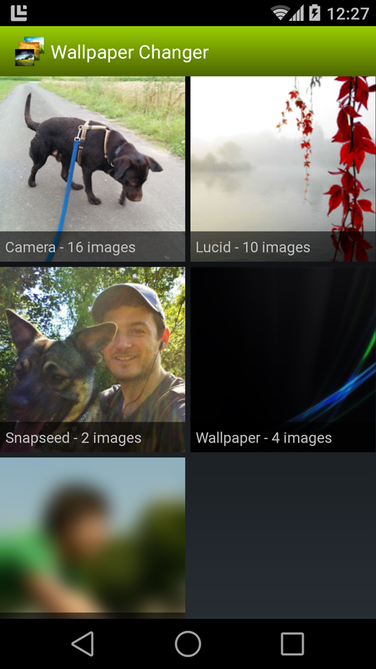
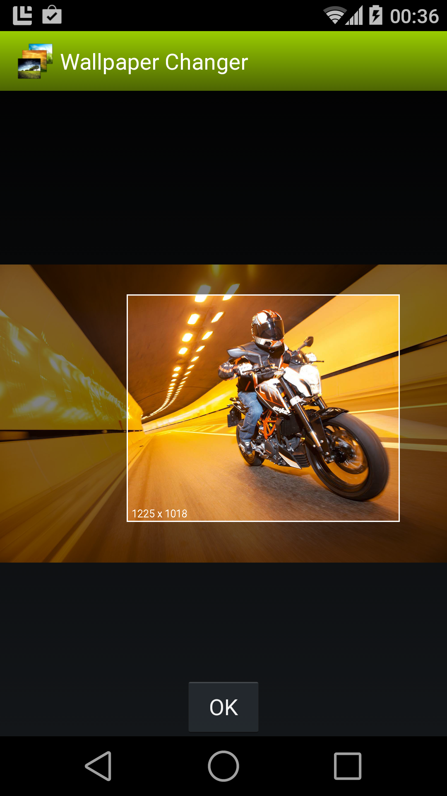

PictureChooser
==============

<table sytle="border: 0px;">
<tr>
<td></td>
<td></td>
<td></td>
</tr>
</table>


Usage
-----

Start with
```java
startActivityForResult(new Intent(context, de.j4velin.picturechooser.Main.class), PICTURE_CHOOSER);
```
and read the "imgPath" StringExtra from the Intent you get in onActivityResult.
To allow the user to crop the image (which will create a copy of the image in your apps directory), add the optional boolean extra "crop" with value "true" to the intent. You can also provide int-extras "aspectX" and "aspectY" to enforce a given aspect ratio on the cropped image.


Example
-----
```java
private final static int ADD_IMAGE = 1;
    
findViewById(R.id.button).setOnClickListener(new OnClickListener() {
    public void onClick(final View v) {
    startActivityForResult(
        new Intent(context, de.j4velin.picturechooser.Main.class)
        // following 3 lines are optional
            .putExtra("crop", true)
            .putExtra("aspectX", 16)
            .putExtra("aspectY", 9), 
        ADD_IMAGE);
    }
});
  
....
  
protected void onActivityResult(int request, int result, final Intent data) {
    if (result == RESULT_OK && request == ADD_IMAGE) {
        String path = data.getStringExtra("imgPath");
        ...
    }
}

```
Build
-----

Add the Android support library to build the project


Apps using this library
-----
Please send a pull request if your app uses this library

* [Wallpaper Changer](https://play.google.com/store/apps/details?id=de.j4velin.wallpaperChanger)
* [Notification Toggle](https://play.google.com/store/apps/details?id=de.j4velin.notificationToggle)
* [Delayed Lock](https://play.google.com/store/apps/details?id=de.j4velin.delayedlock2.trial)
